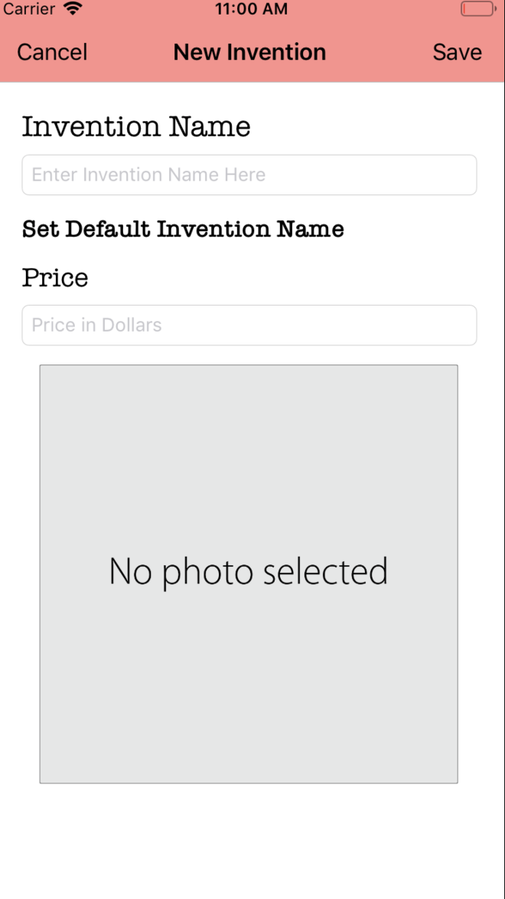

# 🚀 InventorPod  🚀

### 1. What is the app name?

        InventorPod

### 2.  What is this project?

        This project was for the Project Innovation Hackathon 2019 in which the prompt was to help an old man to manage and sell his innovations online in an easy way

### 3. What form is this app in?

        This app was written using the programming language swift, on the platform xcode

### 4. Why did you create this app?

        For the Project Innovation Hackathon 2019

### 5. How to use this app?

        When you run the app, you will see a box. The name of your invention will go in this box. You can use the pop-up keyboard (if used on a phone) or the computer’s keyboard to type the name. By pressing on the return/enter key or the “done” key on the pop-up keyboard, the invention name will save. If you press the “Set Default Invention Name”, then it set the name of the invention to the default text. If you press the “No photo selected” box, the app will lead you to your camera roll in which you can choose an image of your invention. You may have to click a couple of times to make the camera roll pop-up, since it is somewhat slow. If you press the “Save” button, it will potentially save in the table view and lead you to your inventions page. A database is needed in order to actually save it in the cloud/in the app/offline. You will see a list of inventions and your website in the website row which is in the website section. By clicking on the “My Website” Row, in the website section, it will lead you to the advertising website on Safari. By clicking the back button titled InventorPod on Safari, it will lead back to the app.

### 6. What xcode and swift version is the app in?

        It is xcode 10.2, and swift 5

### 7. How does the app look?
    

    

